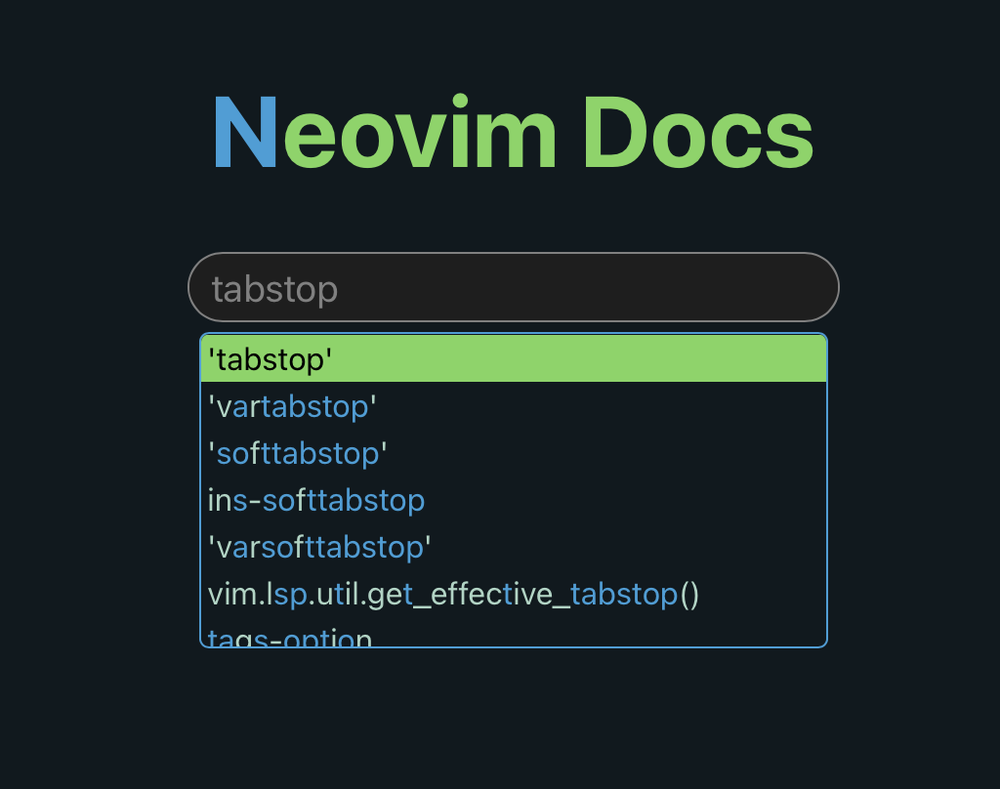

# nvim-docsearch

[Neovim](https://neovim.io)'s much needed online `:help`. Search for anything in neovim on the
existing [online help page catalogue](https://neovim.io/doc/user/)!

## Controls
- **Enter | Mouse-Click**: Open
- **Ctrl-N | Down-Arrow**: Next item
- **Ctrl-P | Up-Arrow**: Previous item

## Details
This project uses a web-scraper to get all its completion items. To update it,
run the `docsearch_gen` project with `cargo` and put `out.txt` into the Svelte
asset directory named `sites.txt`.
